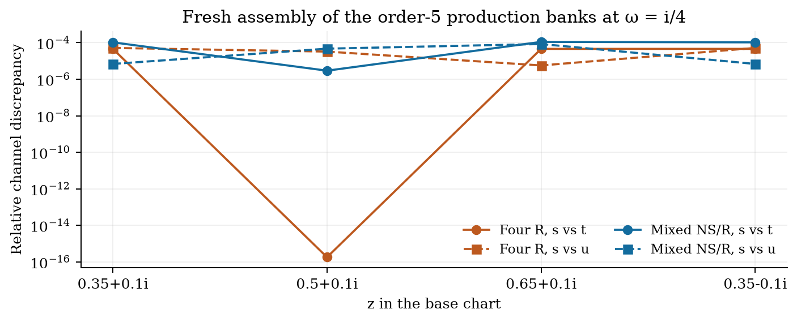
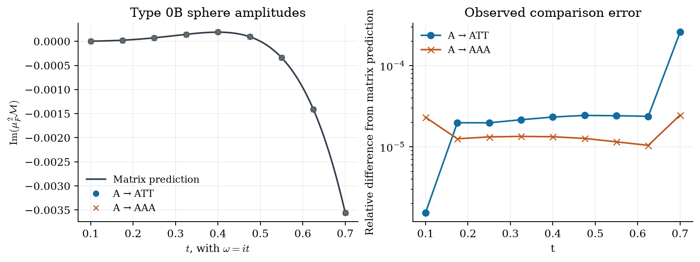

# Local Type 0B conformal blocks

A standalone snapshot of the **local amplitude production convention** for super-Liouville sphere four-point and torus two-point functions. Copy this entire folder anywhere; no sibling checkout or C++ build is needed.

Read the [compiled mathematical note](notes/local_amplitude_blocks.pdf) or its [TeX source](notes/local_amplitude_blocks.tex). It gives the explicit Barnes-G/Upsilon three-point constants, every nonchiral contraction used by these adapters, the block algorithms, the normalization dictionary, numerical crossing checks, and the Type 0B sphere amplitude plot.

## Run

Python 3.11 or later is required. The shipped results were produced with Python 3.11.15 and the versions in [requirements-tested.txt](requirements-tested.txt).

```sh
python3.11 -m venv .venv
.venv/bin/python -m pip install -r requirements-tested.txt
.venv/bin/python -I -B run.py verify
.venv/bin/python -I -B run.py examples --output-dir results
.venv/bin/python -I -B run.py test --output results/validation.json
.venv/bin/python -I -B run.py cross-check --output results/cross_channel.json
```

For one configuration:

```sh
.venv/bin/python -I -B run.py evaluate examples/sphere_rrrr.json --output results/sphere_rrrr.json
```

The seven examples compute conformal blocks and their fixed-momentum correlator assembly. Use a fresh process for each configuration: the preserved scientific trees contain overlapping historical module names. `run.py examples` does this automatically. Small example cutoffs are execution checks, not convergence claims. Higher Ramond orders can be substantially more expensive.

| Configuration | External fields / internal channel | Output |
| --- | --- | --- |
| [sphere_ns](examples/sphere_ns.json) | NS, NS, NS, NS / NS | Stored blocks, BRY-facing blocks, coefficients, G/H/J integrands |
| [sphere_mixed_ns](examples/sphere_mixed_ns.json) | R, R, NS, NS / NS | Native sign/parity blocks and the full physical component sum |
| [sphere_mixed_r](examples/sphere_mixed_r.json) | NS, R, R, NS / R | Native sign/parity blocks and the full physical component sum |
| [sphere_rrrr](examples/sphere_rrrr.json) | R, R, R, R / NS | Native sign/parity blocks and the full physical component sum |
| [torus_ns](examples/torus_ns.json) | Two NS punctures / NS and R | All four spin traces; GG/GG, GG/PP, PP/GG, PP/PP components |
| [torus_r_ope](examples/torus_r_ope.json) | Two R punctures / NS bridge, NS or R handle | OPE blocks, explicit couplings, bare and G0/G0 components |
| [torus_r_radial](examples/torus_r_radial.json) | Two R punctures / one NS and one R edge | Independent radial bare and G0/G0 component sums |

Sphere leg order is `(0,z,1,infinity)`. An R `external` entry is the physical family `0` or `1`; an NS entry is `[holomorphic_star, antiholomorphic_star]`. `chiral_external`, when supplied, selects four chiral component bits. Complex numbers are `[real, imaginary]` pairs. Torus momenta are `(P0,P1)` for NS punctures, `(bridge,handle)` for the RR OPE, and `(NS,R)` for the RR radial channel.

For the NS sphere, `order` counts coefficients within each parity. The shipped example uses exact `c=27/2`; `central_charge_shift` is explicit and otherwise inherits the production evaluator's `1e-5` default. Optional `"quadrature": {"Pmax": 5, "nodes": 36}` also computes a finite spectral integral. R sphere and NS torus cutoffs are **twice-levels**. The RR torus uses independent bridge order, NS twice-level and R integer-level cutoffs. The note specifies the precise series truncations.

## Normalization that must travel with the blocks

- The production NS constants are `C` and `Ctilde`; the odd graded coefficient is `i*Ctilde`.
- The raw NSRR functions are `E,O`; the amplitude adapters use `c+=(E/2), c-=(O/2)` and physical half-sums `(E±O)/2`. Two such trinions contribute a factor `1/4`. NS punctures with R internal edges additionally retain the odd PP pairing sign `(-1)^f`.
- The sphere scattering half-sum field has effective continuum metric `D_R/D_NS=1/2`. Its reduced finite ground vector has unit norm. Converting to equal continuum metrics requires rescaling fields, couplings and external axion coefficients together. Doubling two vertices alone produces four. The package preserves the amplitude convention.
- The latest RR torus wrappers multiply the completed radial correlator by `2`, and OPE theta components `(1,2,3,4)` by `(2,2,1,1)`. These are the existing relative correlator prefactors; the original Clifford `1/2`, Grams and chiral coefficients are retained. The common genus-one string-amplitude constant remains undetermined.
- At complex energies, antichiral evaluation is an analytic continuation in its specified frame. Taking an absolute square of every coupling or block changes the answer.

Each JSON result states its measures and coordinate factors. Sphere `dP_integrand` includes `1/pi` and external Liouville legs. NS torus component integrands include `1/pi^2` and internal propagation; external `2pi`, PCO, time and ghost factors are excluded. RR torus values include their local correlator normalization and coordinate convention, but exclude `1/pi^2` and the unresolved common string-amplitude constant. Radial/OPE **spectral integrals**, not individual internal-momentum integrands, are the cross-channel comparison.

## Checks and figures

[validation/science.json](validation/science.json) records fresh calculations:

| Check | Result |
| --- | --- |
| R sphere coefficients against actual production banks, all three families and both analytic chiralities | 576 coefficients through twice-level 2 match at stored precision |
| NS primary crossing, BRY order 8, 36 nodes, `Pmax=5` | Relative discrepancy below `2.35e-12` at the two stated points |
| NS torus adapter against the production even-spin assembler at complex energy | 12 components, scaled difference below `3.84e-20` |
| RR torus prefactors, G0 relations and global level-one identity | Residual below `1.12e-16`; unchanged chiral blocks |

[validation/cross_channel.json](validation/cross_channel.json) freshly assembles the included order-five sphere banks at incoming `omega=i/4`. Maximum channel discrepancies are `5.15e-5` for four R and `1.11e-4` for mixed NS/R. Mixed picture-placement discrepancies are below `2.40e-5`. The command checks an explicit `5e-4` regression threshold, which is not an absolute numerical error bound. The note gives quadrature, chart factors and all individual results.



The Type 0B sphere amplitude figure uses the retained nine-energy production scan, with incoming `omega=it` and equal outgoing energies `it/3`. The target is `mu_F^2 M = i*t^4*(1-2*t)/27` for both `A -> ATT` and `A -> AAA`; no scale is fitted. Maximum observed differences are about `0.02581%` and `0.00247%`, respectively.



These amplitude integrations and the larger RR torus modular/cross-channel checks are **retained evidence**, not rerun production campaigns. The complete evidence and input hashes are in [notes/evidence](notes/evidence) and [provenance/evidence_origins.json](provenance/evidence_origins.json). There is no completed integrated RR torus amplitude or fixed absolute genus-one string normalization in this snapshot. The R-tilde NS-puncture example is a Liouville supertrace, not a completed odd-spin string density.

Regenerate figures and compile the note (TeX Live with `latexmk` and `pdflatex`):

```sh
.venv/bin/python -B tools/make_figures.py
.venv/bin/python -B tools/build_note.py
```

## Source and provenance

The base Git commit was `4887104301ec1f3666cfad058518cd01f53b761e`. This package also captures the local scientific changes and machine notes present on 24 September 2026; it is **not** a claim that those working files were already in that commit. [provenance/source_origins.json](provenance/source_origins.json) records every copied file's original path and SHA256. The originals are unmodified.

| Code under `source/project` | Role |
| --- | --- |
| `Code/c_Recursion/super_liouville_structure_constants.py` | Explicit `b=1` constants |
| `Code/c_Recursion/sphere_four_point.py`, `superconformal_blocks.py`, `ns_recursion_recipe.py` | NS sphere correlators, multiprecision recursion and residue products |
| `Data Set/type0b_rr_sphere_20260921/het_inputs/Codes/literature_precision_blocks.py` | Frozen production precision bootstrap for R sphere blocks |
| Same directory: `literature_double_virasoro.py`, `literature_self_dual_blocks.py`, `literature_component_blocks.py` | Finite branching, assembled self-dual limit and physical component sum |
| `Code/type0b_rr_sphere/normalization.py`, `projection.py`, `compute.py` | Actual Type 0B leg factors, kernels and crossing comparisons |
| `Code/type0b_genus1/prepare.py`, `ns_recursion.py`, `ramond_descendants.py`, `even.py` | NS-puncture torus coefficients and production sewing |
| `Code/type0b_rr_genus1/ope_channel.py`, `local_density.py`, `numeric_nrr.py`, `radial_trace.py`, `internal_normalization.py` | RR torus Ward/Gram algorithms, two channels and existing normalization wrappers |

The frozen sphere release verifies all **436** original source-manifest entries, so their complete source set is retained. Only **96** of its **864** bank records are bundled: the 32 `t0250` nodes for each of `mixed_ns`, `mixed_r`, and `rrrr`. The original upstream manifest is preserved, not rewritten to pretend the other banks are present. The exposed crossing command requests only the bundled energy. The torus source closure and its small preserved reference dependency are also included; no external handoff directory is read at runtime. Some copied legacy files describe other campaigns; those campaigns are outside the supported commands above.

The source-closure `unresolved` names in [provenance/snapshot.json](provenance/snapshot.json) are static-scanner classifications, including standard-library, third-party and dynamically bootstrapped imports. They are not a runtime test result. [validation/portability.json](validation/portability.json) records the separate copied-folder run with Python isolated mode and an unrelated working directory.

Original machine notes:

- [Sphere normalization fixed by the BRY four-point check](notes/originals/Machine%20Notes/LONG_DRAFT_BRY_SPHERE_CHECK_2026-09-23.md)
- [Nonchiral sewing audit](notes/originals/Machine%20Notes/LONG_DRAFT_NONCHIRAL_SEWING_2026-09-23.md)
- [NSRR factor-of-two/four resolution](notes/originals/Machine%20Notes/Genus%202/NSRR_NORMALIZATION_RESOLUTION_2026-09-24.md)
- [RR torus relative normalization](notes/originals/Code/type0b_rr_genus1/INTERNAL_NORMALIZATION.md)

These archival copies retain their original internal links, some of which refer to the original repository. The new TeX note and the links above are the portable entry points.

`MANIFEST.json` covers all release files except itself. `run.py verify` checks their SHA256 values. Editing inputs or rebuilding figures changes these hashes; after intentionally creating a new release, `python -B tools/make_manifest.py` regenerates the package manifest. User outputs in `results/` and build caches are excluded.
